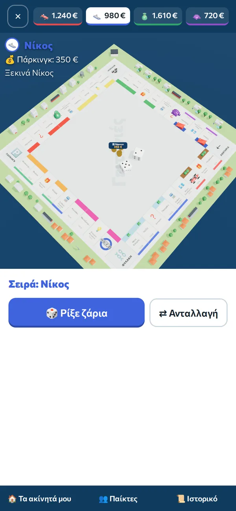
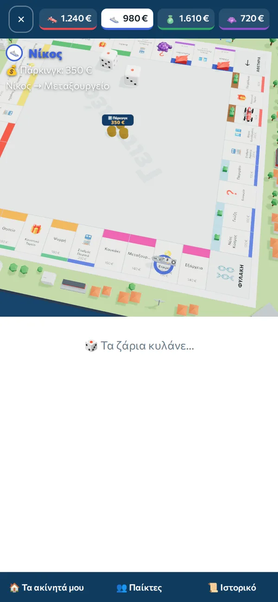
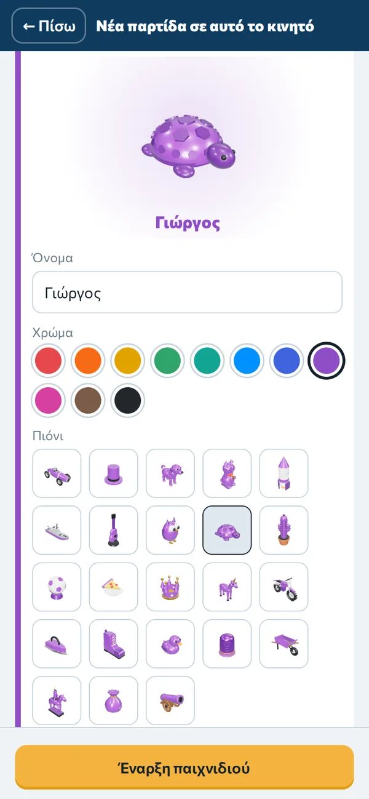
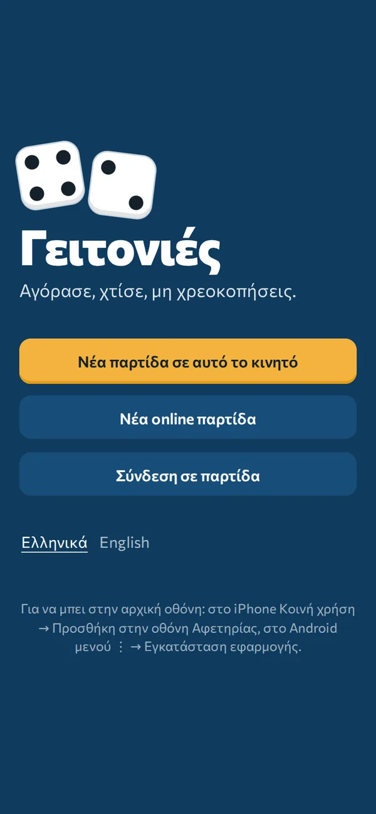
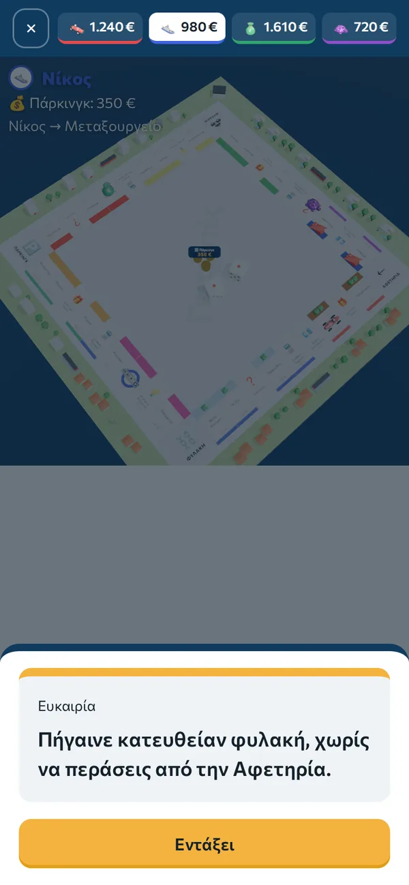
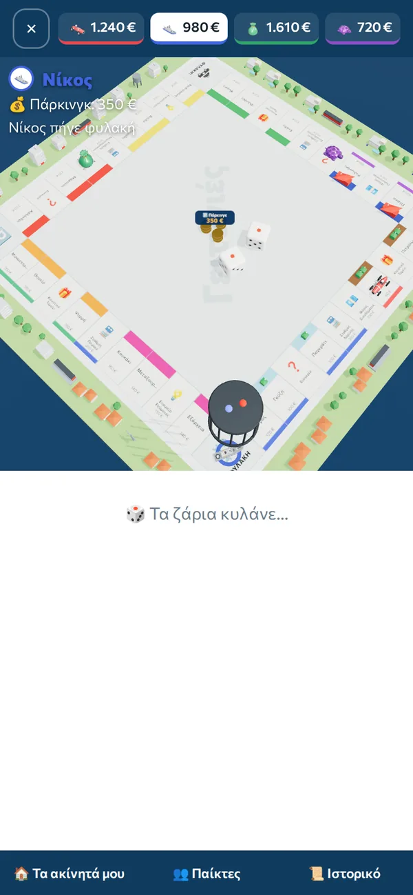
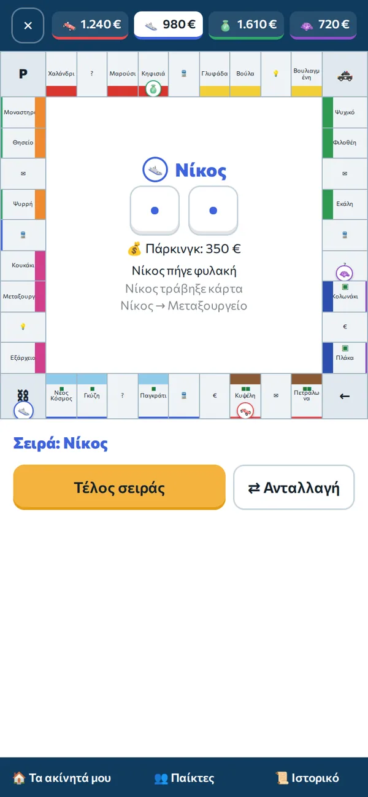
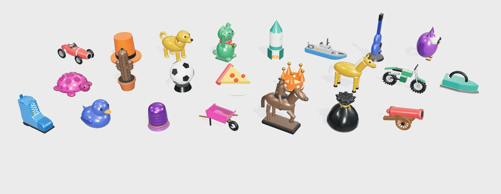

<div align="center">

# 🎲 Geitonies (Γειτονιές)

**A real-estate board game for phones — 2 to 10 players, a 3D board, and online play without a server.**

[](https://github.com/petrosfs/Geitonies-mobile/actions/workflows/deploy.yml)


### ▶️ [Play now: petrosfs.github.io/Geitonies-mobile](https://petrosfs.github.io/Geitonies-mobile/)

🇬🇷 [Οδηγός για παίκτες στα Ελληνικά](docs/README.el.md)

  

</div>

## What it is

A complete, Monopoly-style property game set in Athens neighbourhoods, built as an installable web app.
Players buy neighbourhoods, build houses and hotels, trade, auction and try not to go bankrupt —
either passing one phone around the table, or each on their own phone over the internet.

It runs entirely in the browser: no app store, no accounts, no backend, no running costs.

## Features

- **Full rules engine** — rent and colour groups, even building with a limited bank stock, mortgages, jail (3 doubles, fines, cards), Chance / Community Chest, open and sealed auctions, trades with counter-offers, bankruptcy to players or the bank, time-limited games, optional house rules.
- **Two boards** — classic (40 squares, 2–6 players) and a large 56-square board for 7–10 players.
- **3D board** (three.js) — physics-simulated dice, 23 hand-modelled pieces, a small city of buildings around the board, a camera that follows each move, animated coins for every payment, a jail cage with sirens. A 2D board is available for older phones.
- **Online play, peer-to-peer** — one phone hosts, the others join with a 5-letter code or a QR code. Chat, presence, automatic moves for absent players, reconnection, and host take-over if the host disappears.
- **Customisable** — three city name sets (Athens, Patras, Thessaloniki), move any neighbourhood to another colour group, rename squares, write your own cards, pick colours, pieces and photos, choose house rules.
- **Installable PWA** — works offline for one-phone games, updates itself.
- **Built-in rules** — short, expandable sections; inside a game they start with that game's own settings.
- **Greek and English** interface; end-of-game statistics and one-tap rematch.

| | | | |
|:-:|:-:|:-:|:-:|
|  |  |  |  |
| Home | Chance card | Jail | 2D board |

<p align="center"></p>

## Engineering highlights

- **Pure, deterministic game engine.** All rules live in a side-effect-free reducer (`apply(state, player, action) → state`) with a seeded RNG. The UI, the network layer and the tests all drive the same function. → [`src/game/engine.ts`](src/game/engine.ts)
- **Host-authoritative peer-to-peer networking.** WebRTC data channels via PeerJS; only the host applies actions and broadcasts state. Clients self-heal: any version mismatch triggers a resync, rejected moves return the true state, the host keeps reconnecting to the signalling server, and a client can take over as host after 5 minutes. → [`src/store.ts`](src/store.ts)
- **Physics that always agrees with the rules.** The dice roll is decided by the engine first; the throw is then simulated ahead of time with cannon-es, the faces are painted so the resting top face shows the rolled number, and the result is played back frame by frame. → [`src/three/dice.ts`](src/three/dice.ts)
- **Procedural 3D content.** All pieces and buildings are built from code (lathes, extrusions, lofted ship hull, bump-mapped thimble), so there are no model files to license or download. → [`src/three/pieces.ts`](src/three/pieces.ts)
- **Robustness by design.** Animations can never block the game (watchdog + fallbacks), WebGL context loss rebuilds the scene, and old saved games keep loading after updates.

More detail: [docs/ARCHITECTURE.md](docs/ARCHITECTURE.md)

## Testing and CI

Every push to `main` runs **lint → unit tests → build → browser tests → deploy**; nothing is published unless everything passes.

- **75 unit tests (Vitest)** — targeted rule tests, 60 fully simulated random games checking invariants, 3,000 simulated dice throws (always flat, inside the board, showing the rolled value), every 3D piece, translation coverage (every message exists in Greek and English), and the in-app rules (every amount filled in from the board).
- **12 end-to-end tests (Playwright)** — real browser play on the 3D and 2D boards, menus, rules, city names, jail, language switch, end of game and rematch, and two-phone online tests: chat, sync, the host losing the internet, and a phone stuck on an outdated screen recovering by itself.

## Tech stack

React 19 · TypeScript · Vite · three.js · cannon-es · PeerJS (WebRTC) · vite-plugin-pwa · Vitest · Playwright · Oxlint · GitHub Actions · GitHub Pages

## Run locally

```bash
npm install
npm run dev          # http://localhost:5173  (add --host to open it from a phone on the same Wi-Fi)
npm test             # unit tests
npx playwright install chromium && npm run e2e   # browser tests
npm run build        # production build in dist/
```

## Project structure

```
src/
  game/        rules engine, boards, cards, types (pure TypeScript, no UI)
  three/       3D scene, dice physics, procedural pieces, thumbnails
  store.ts     app state, saving, peer-to-peer networking, chat
  *.tsx        screens: home, setup, lobby, game
tests/e2e/     Playwright browser tests (local and online)
docs/          architecture notes, Greek player guide, screenshots
```

## Development

Designed, directed and tested by [@petrosfs](https://github.com/petrosfs); implemented with AI pair-programming
(Claude by Anthropic). Feature decisions, rules choices, playtesting and bug reports from real games drove each iteration —
see the [changelog](CHANGELOG.md).

## Roadmap

- Computer opponents (bots) for solo play and to replace players who leave
- Own TURN server option for networks that block peer-to-peer connections

## License

© petrosfs. **All rights reserved.** The source code is published so it can be viewed and evaluated;
no licence is granted to copy, modify, redistribute or use it commercially. You are welcome to play the game at the link above.
For any other use, please [open an issue](https://github.com/petrosfs/Geitonies-mobile/issues) to ask.

---

<sub>Not affiliated with or endorsed by Hasbro. "Monopoly" is a trademark of Hasbro; this is an independent game with its own artwork, pieces and texts.</sub>
